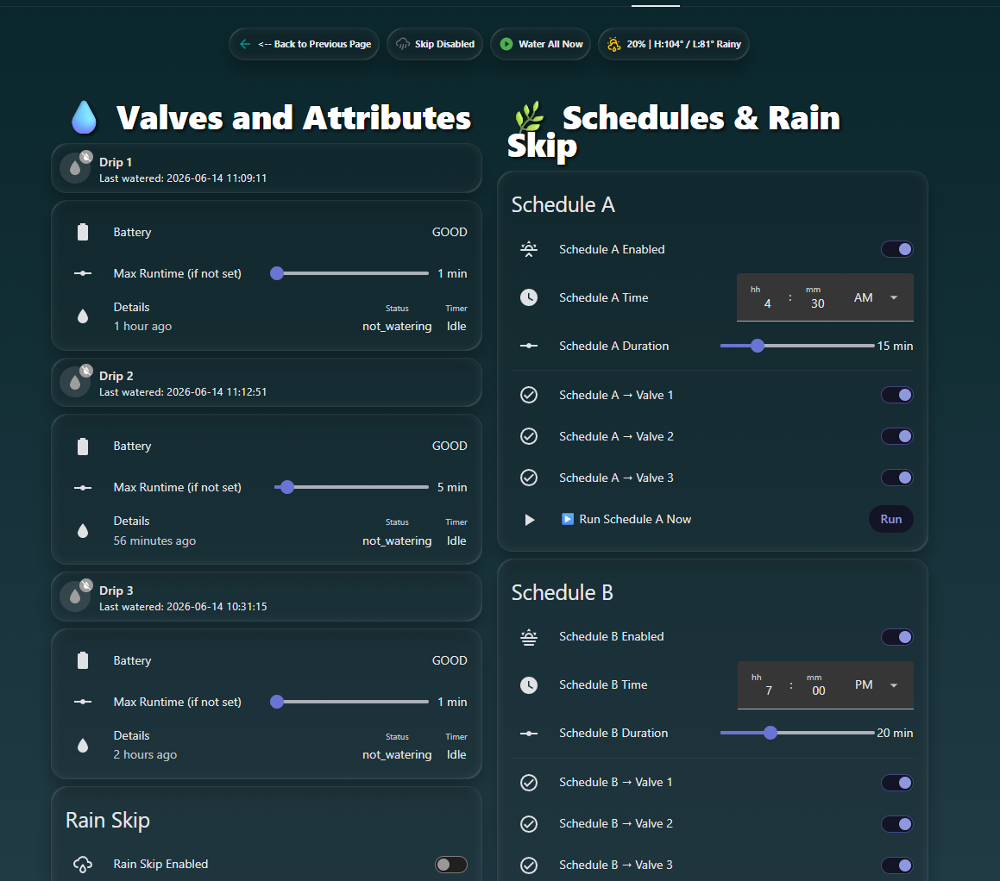
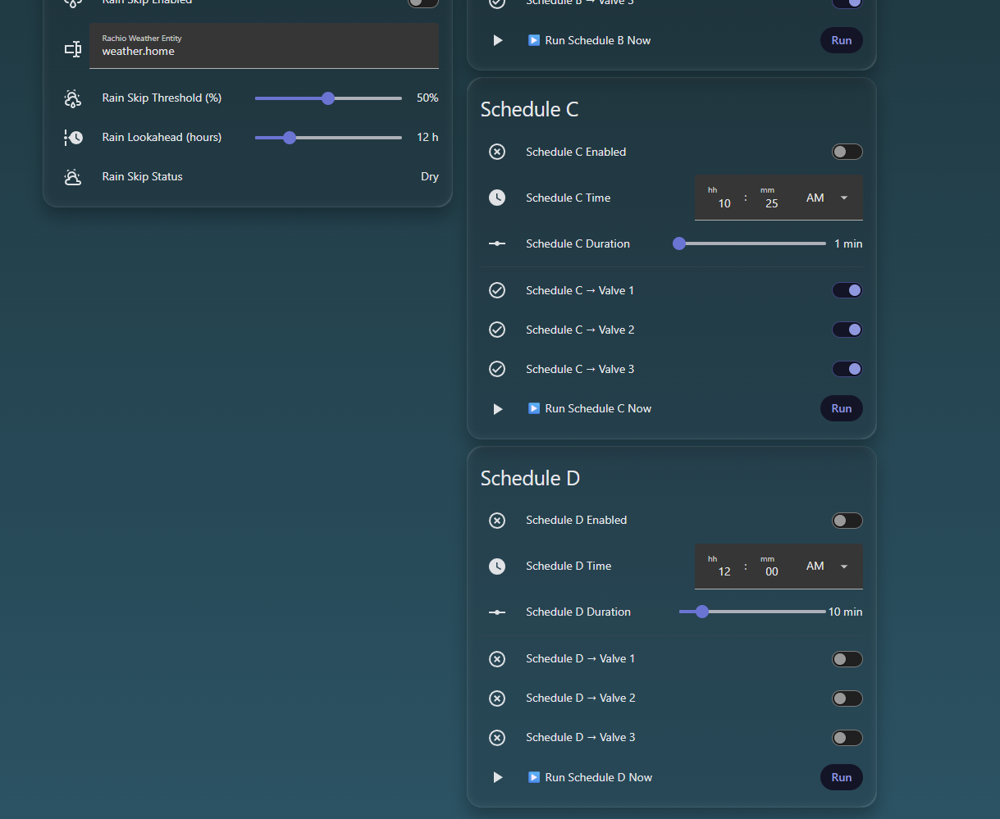
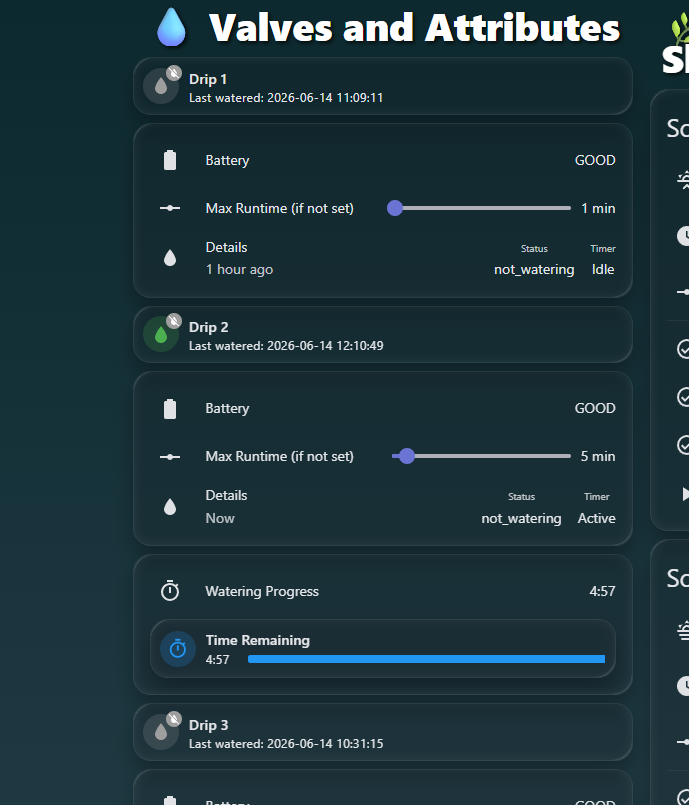

# 💧 Rachio Local Control — Home Assistant Package

A Home Assistant package for controlling Rachio irrigation valves. Includes a scheduler, rain skip via OpenWeatherMap, last-watered tracking, and a polished Mushroom dashboard.

> **Version:** v1.0  
> **Author:** [Prickly Guy Creations](https://github.com/pricklyguy)

---

## Features

- **4 independent schedules** (A, B, C, D) — each with configurable time, duration, and per-valve toggle
- **Rain skip** — checks OpenWeatherMap precipitation probability and skips if threshold is met
- **Last watered tracking** — logged automatically on every run (scheduled or manual)
- **HA timers** as a safety net — valve auto-shutoff even if HA restarts mid-run
- **Sequential watering** — valves run one at a time, in order
- **Manual control** — tap any valve card to water it now; tap again or use "Stop All" to cancel


---

## Requirements

### HACS Integrations
- [Rachio Local Control](https://github.com/rachio/rachio-ha) — provides the `switch.drip_*` and `sensor.drip_*_status` entities
- [Mushroom Cards](https://github.com/piitaya/lovelace-mushroom)
- [Multiple Entity Row](https://github.com/benct/lovelace-multiple-entity-row)
- [Timer Bar Card](https://github.com/rianadon/timer-bar-card)
- [Browser Mod](https://github.com/thomasloven/hass-browser_mod) — for the back button on the dashboard header

### HA Integrations (built-in)
- [OpenWeatherMap](https://www.home-assistant.io/integrations/openweathermap/) — for rain skip forecast data

---

## Installation

### 1. Enable Packages in `configuration.yaml`

If you haven't already, add this to your `configuration.yaml` so HA loads the package:

```yaml
homeassistant:
  packages: !include_dir_named packages
```

Then place `rachio.yaml` in your `/config/packages/` folder.

### 2. Add the Dashboard

In Home Assistant:
- Go to **Settings → Dashboards → Add Dashboard**
- Switch to YAML mode and paste the contents of `dashboards/rachio_dashboard.yaml`

Or if you use `ui-lovelace.yaml` / dashboard files directly, copy it to your dashboards folder.

### 3. Customize Entity IDs

Open `packages/rachio.yaml` and update these to match your actual entities from the Rachio Local Control integration:

| Placeholder | Replace with |
|---|---|
| `switch.drip_1` | Your Zone 1 switch entity |
| `switch.drip_2` | Your Zone 2 switch entity |
| `switch.drip_3` | Your Zone 3 switch entity |
| `sensor.drip_1_status` | Your Zone 1 status sensor |
| `sensor.drip_1_battery` | Your Zone 1 battery sensor |
| `notify.my_notification_group` | Your notification target |

> Entity IDs vary by Rachio model and device name. Check **Developer Tools → States** after installing the integration to find yours.

### 4. Configure Rain Skip

After restarting HA, go to the Rachio dashboard and set:
- **Rain Skip Threshold (%)** — watering skips if forecast rain probability meets or exceeds this
- **Rain Lookahead (hours)** — currently uses today's daily forecast (OpenWeatherMap)
- Toggle **Rain Skip Enabled** on

---

## Package Structure

```
rachio/
├── packages/
│   └── rachio.yaml          # All HA inputs, timers, templates, scripts, automations
├── dashboards/
│   └── rachio_dashboard.yaml  # Mushroom-based Lovelace dashboard
└── README.md
```

---

## How It Works

### Schedules
Each schedule (A–D) has:
- A **time trigger** (`input_datetime`)
- An **enable toggle** (`input_boolean`)
- A **per-valve toggle** for which valves to include
- A **duration** that applies to each selected valve

When triggered, `script.rachio_run_schedule` runs selected valves **sequentially** — Valve 1 completes before Valve 2 starts.

### Rain Skip
A triggered template binary sensor (`binary_sensor.rachio_rain_skip_now`) evaluates every 30 minutes against the OpenWeatherMap daily forecast. If rain probability ≥ threshold and rain skip is enabled, the schedule call exits early with a notification.

### Timer Safety Net
Every valve start also fires an HA `timer`. If the valve hasn't been turned off by the time the timer expires, an automation shuts it off. If you turn a valve off manually, the automation cancels its timer.

---

## Roadmap / Known Limitations

- Rain skip uses today's daily forecast only — hourly lookahead planned for v2
- Entity IDs are currently hardcoded — v2 will use `input_text` helpers for easier setup
- "Water All Now" runs valves simultaneously (toggle_all) — v2 will make this sequential to match schedule behavior
- Currently supports 3 valves — expandable by duplicating the pattern

---

## Screenshots




---

## License

MIT — free to use, modify, and share.
